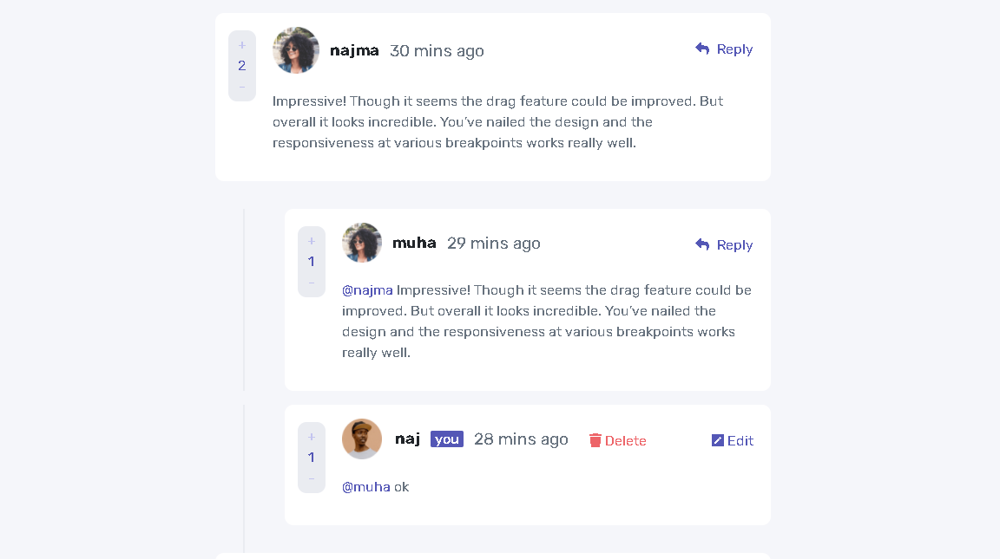

# Frontend Mentor - Interactive comments section solution

This is a solution to the [Interactive comments section challenge on Frontend Mentor](https://www.frontendmentor.io/challenges/interactive-comments-section-iG1RugEG9). Frontend Mentor challenges help you improve your coding skills by building realistic projects.

## Table of contents

- [Overview](#overview)
  - [The challenge](#the-challenge)
  - [Screenshot](#screenshot)
  - [Links](#links)
- [My process](#my-process)
  - [Built with](#built-with)
  - [What I learned](#what-i-learned)
  - [Continued development](#continued-development)
  - [Useful resources](#useful-resources)
- [Author](#author)

## Overview

### The challenge

Users should be able to:

- View the optimal layout for the app depending on their device's screen size
- See hover states for all interactive elements on the page
- Create, Read, Update, and Delete comments and replies
- Upvote and downvote comments
- **Bonus**: If you're building a purely front-end project, use `localStorage` to save the current state in the browser that persists when the browser is refreshed.
- **Bonus**: Instead of using the `createdAt` strings from the `data.json` file, try using timestamps and dynamically track the time since the comment or reply was posted.

### Screenshot

### Links

- Solution URL: [solution url](https://www.frontendmentor.io/solutions/css-gridcss-flexboxnodejs-mongodb-6Tc1e1OSt)
- Live Site URL: [live site](https://interactive-comment.herokuapp.com/)

## My process

### Built with

- Semantic HTML5 markup
- CSS custom properties
- Flexbox
- CSS Grid
- Mobile-first workflow
- Node.js
- mongodb

### What I learned
i learnt how to create modals and how to manipulate html elements with javascript

### Continued development
i want to work on how to make my front-end designs more responsive

### Useful resources

- [w3school creating modal box with css and js](https://www.w3schools.com/howto/howto_css_modals.asp) - This helped me to create the modal box.

## Author
- Frontend Mentor - [@muhammadkeyton](https://www.frontendmentor.io/profile/muhammadkeyton)
